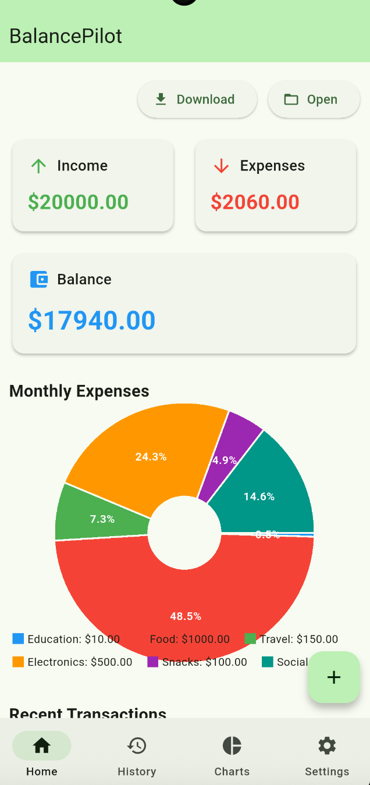
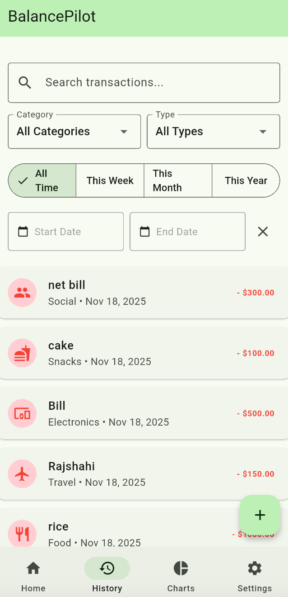
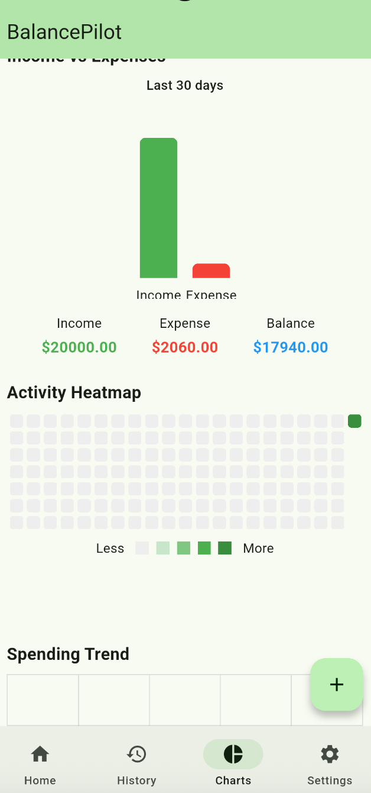

# 💰 BalancePilot: Your Personal Finance Companion 🚀

A powerful and visually appealing **balance tracking application** built with **Flutter**. It helps you track your income, expenses, and savings with a user-friendly interface and beautiful charts, all in one place.

## ✨ Key Highlights

## 1. Daily Expense Tracking  
Track everyday spending with categories.

## 2. Income Tracking  
Record all income sources.

## 3. Category-Based Organization  
Organize expenses into Food, Transport, Shopping, etc.

## 4. Budget Alerts (Added ✔)  
- Intelligent alerts at 50%, 80%, and 100%  
- Push notifications + in-app warnings  
- Color indicators (Green → Yellow → Red)  
- Optional Silent Mode  
- Budget suggestions

## 5. Multi-Currency Support (Manual Mode) (Added ✔)  
- Choose any currency (BDT, USD, EUR, GBP, etc.)  
- User manually sets exchange rate  
- Stored locally, no API required  
- Auto recalculation when rate changes  
- Currency formatting + symbol support  
- Option to lock exchange rate  
- Works offline

## 6. Report Download (Added ✔)  
- Download Monthly/Yearly PDF  
- Export CSV  
- Clean table + graph included  
- Offline export support

## 7. Charts & Analytics  
Pie chart, bar chart, spending graph.

## 8. Recurring Expenses  
Auto-repeat monthly expenses.

---

## 🖼️ Application Screenshots (Better View)

  
  
  

### 💡 Description:
The images above provide a snapshot of the **Home Screen** (left), the **Filter options** (middle), and the **Chart analysis** (right), showcasing the app's clean design and core features at a glance.

---

## 🔗 Links & Badges

| Badge | Description |
| :--- | :--- |
|  | Latest Release Version |
|  | Total Downloads Count |
|  | Licensing Information |
|  | Total GitHub Stars |
|  | Total GitHub Forks |
|  | Open Issues Count |
|  | Date of Last Commit |
|  | Total Contributors |

## 🌟 Features

With BalancePilot, you can:

* **📝 Transaction Management:** Easily add, edit, and delete transactions.
* **🏷️ Categorization:** Create and use your own categories for income and expenses.
* **📊 Charts & Graphs:** Quickly visualize your spending patterns with interactive charts and graphs.
* **🎨 User Interface:** A stunning, user-centric design, including dark mode support.
* **💾 Data Persistence:** Keep all your financial data securely stored locally.

---

## 🛠️ Technology Stack

BalancePilot is built using the following technologies:

* **Framework:** Flutter
* **Language:** Dart
* **Database:** (Add your database here, e.g., Hive, SQLite, Isar)
